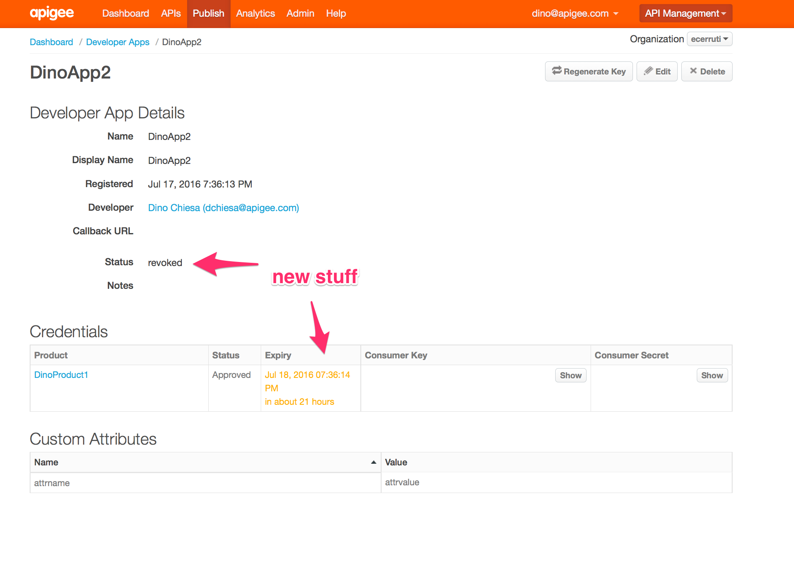

# Apigee Edge UI Tampermonkey script to display Key Expiry

This is a [Tampermonkey](https://tampermonkey.net/) script that tweaks
the Apigee Edge UI to display expiry information for a Developer App Key in the browser
page.  It also displays the status of the developer app itself.

## Background

Apigee Edge has a concept of Developer App. Each developer app has:

* a name
* a creation date
* a status (approved or revoked)
* a list of zero or more credentials

Each credential has:

* a consumer key and secret
* an approved/revoked status
* an issued-at time
* optionally, an expiry
* a list of zero or more API products for which the credential is valid

Taking flexibility to the extreme, each API Product on a credential can have a approved/revoked status as well.

If the developer app is marked "revoked", then the status of descendant entities is ignored.
If the credential is marked "revoked", then the status of API Products within the credential is ignored.

This tampermonkey script shows the expiry of each credential, and the status of the developer app as a whole. 

## Installing

Tampermonkey is a browser extension, that works on Firefox, Chrome, Safari, etc.

1. Visit  [tampermonkey.net](https://tampermonkey.net/) and install Tampermonkey

2. Then, use the tampermonkey menu to add a new script.
  

3. copy-paste the [key-expiry.user.js](lib/key-expiry.user.js) script into place.

4. Reload the browser tab that is displaying the Developer app.

5. Done.

## Bugs

* This script doesn't properly handle the edit event.  
  The screen will become garbled. To correct that, reload the page after editing a developer app. 

